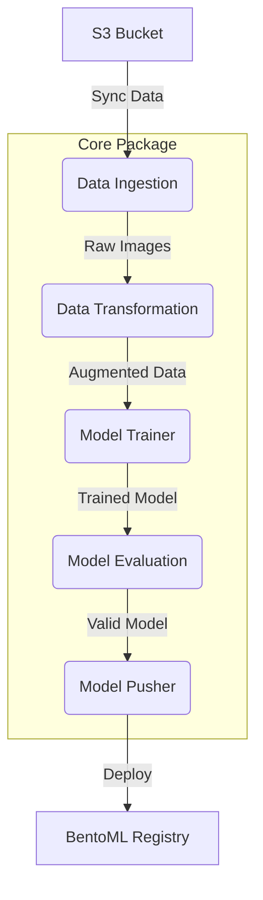

# ML Pipeline Architecture

The Pneumonia Classifier uses a modular, component-based pipeline architecture to ensure scalability and maintainability.



## Pipeline Components

### 1. Data Ingestion

- **Source**: S3 Bucket (`pneumoniaclassifier`).
- **Function**: Syncs raw X-ray images into localized `artifacts/` directories, maintaining class separation (NORMAL/PNEUMONIA).

### 2. Data Transformation

- **Augmentation**:
  - `ColorJitter`: Contrast, Saturation, and Hue adjustments.
  - `RandomHorizontalFlip` and `RandomRotation`.
- **Normalization**: Standard ImageNet mean/std (`[0.485, 0.456, 0.406]`, `[0.229, 0.224, 0.225]`).
- **Output**: Serialized transformation objects (`.pkl`) and PyTorch DataLoaders.

### 3. Model Training

- **Architecture**: `Net` (9 Convolutional layers + Global Average Pooling).
- **Optimizer**: SGD with Momentum (0.8).
- **Loss**: Negative Log Likelihood (`nll_loss`) on `log_softmax` predictions.
- **Hardware**: CUDA-accelerated if available, otherwise CPU.

### 4. Model Evaluation

- **Validation**: Evaluates the model on a separate test set.
- **Metrics**: Accuracy, Loss, and per-class performance tracking.

### 5. Model Pusher

- **Registry**: Saves the trained PyTorch model and transformation objects into **BentoML** for local or cloud serving.

## Execution

To trigger the full pipeline:

```bash
python pneumonia_classifier/pipeline/training_pipeline.py
```
