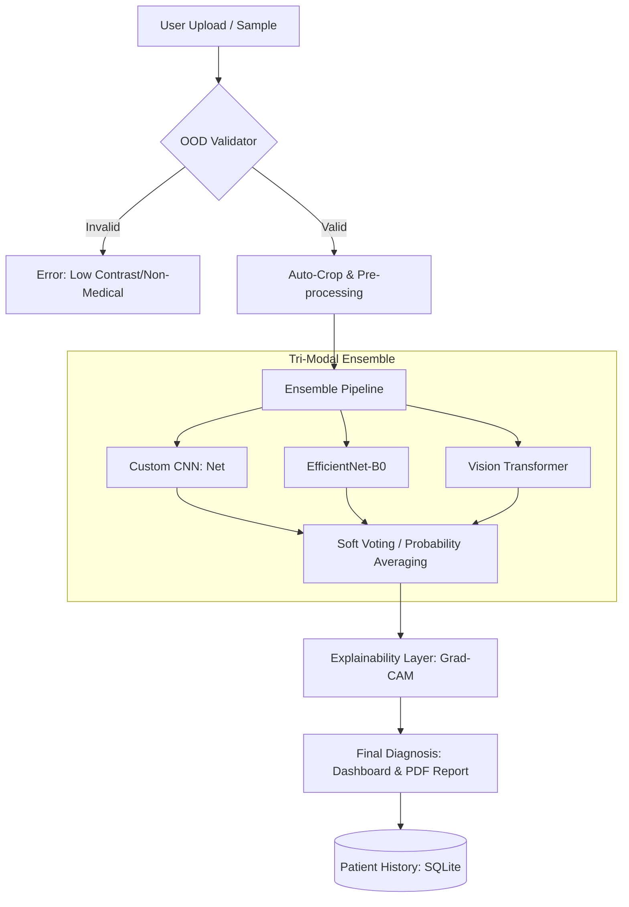

# Pneumonia Classifier: System Architecture

This diagnostic suite utilizes a high-reliability **Tri-Modal Ensemble** architecture with integrated explainability and validation layers.

## High-Level Workflow

## Component Breakdown

### 1. Ingestion & Validation

- **OOD Detection**: Deterministic heuristics (StdDev & Corner Sampling) to filter non-medical inputs.
- **Auto-Crop**: OpenCV-based contour detection to focus on the lung field.

### 2. Tri-Modal Ensemble

Combined decision-making from three distinct mathematical perspectives:

1. **Custom CNN (`Net`)**: Tailored feature extraction for X-ray imagery.
2. **EfficientNet-B0**: Pre-trained convolutional efficiency for texture/density analysis.
3. **Vision Transformer (ViT)**: Global self-attention to understand spatial relationships across lung lobes.

### 3. Explainability & Logging

- **Grad-CAM**: Visualizes neural focus regions via heatmaps overlaid on the original radiograph.
- **Persistence**: SQLite database tracks patient outcomes and heatmap paths for clinical auditing.
- **Reporting**: Automated ReportLab engine generates professional PDF documentation with embedded heatmaps.
